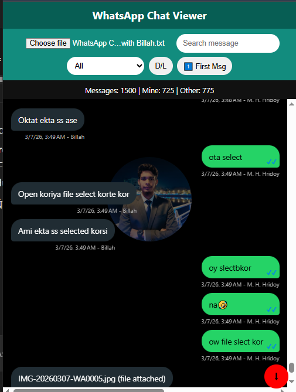
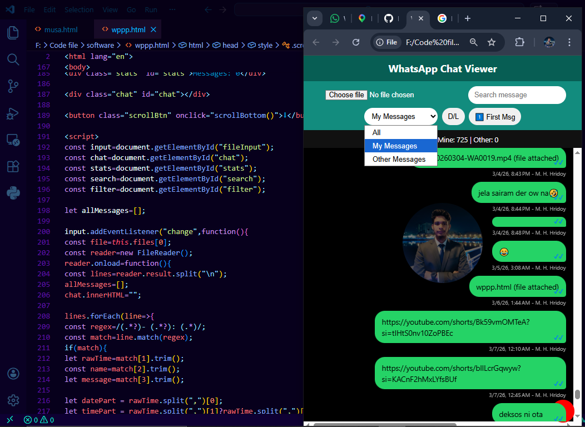
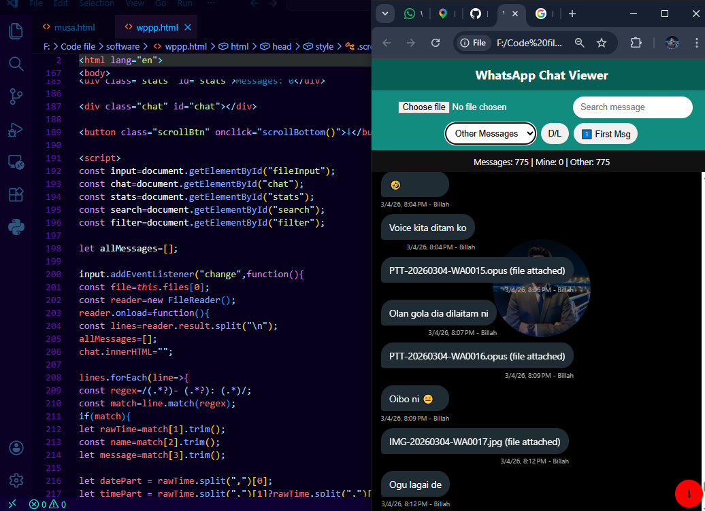
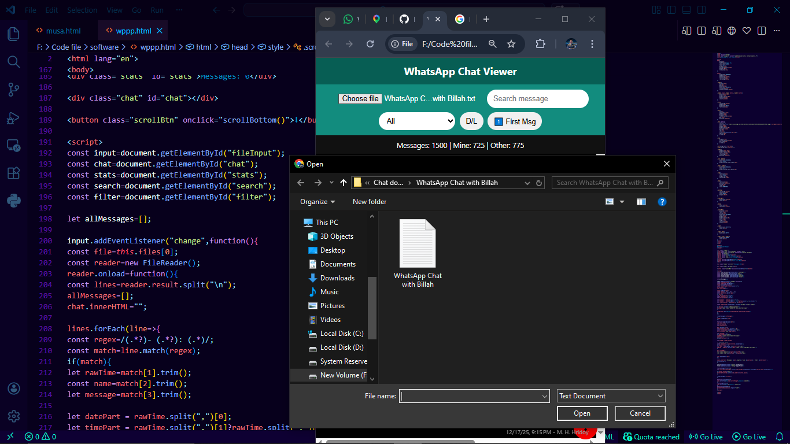

## Upload Date: <i style="color:#25D366;">12 March 2026</i>

# 💬 WhatsApp Inbox Viewer

A simple and beautiful **WhatsApp chat viewer** that converts exported **.txt chat files** into a **WhatsApp-style conversation interface** directly in your browser.

Built using **HTML, CSS, and JavaScript**.

## Live Preview

🔗 Live Preview & Use the App: https://chatviewer-2d185.web.app/


## 🎥 Demo Video

<p align="center">
  <a href="https://youtu.be/VfxzIJI9DPc?si=vTGTLrCXx8CnCmpz">
    
  </a>
</p>

---

## DemoView


----


---

## 📸 Preview

Upload your exported WhatsApp chat file and instantly see the conversation in a clean WhatsApp-style layout.


Upload Chat (.txt)
↓
Beautiful WhatsApp Style Chat Interface


---

## ✨ Features

* 📂 Upload exported **WhatsApp .txt chat file**
* 💬 Messages displayed in **WhatsApp chat bubble style**
* 🟢 **User messages (green)** and **other messages (dark)** layout
* 🕒 Shows **message time and sender name**
* 🖼 Fixed center background image
* 📱 **Responsive design** for desktop and mobile
* ⚡ Instant chat rendering in the browser
* 🔽 Auto scroll to the latest message

---

## 🛠 Technologies Used

* HTML5
* CSS3
* JavaScript (Vanilla JS)

---

## 📂 Project Structure


whatsapp-inbox-viewer
```
│📂Code
├── index.html
├── funtion.js
├── style.css
└── README.md
```

---

## 🚀 How to Use

1. Open **WhatsApp**
2. Export chat from any conversation
3. Choose **Without Media**
4. Save the **.txt file**
5. Open this web page
6. Upload the `.txt` file

Your chat will instantly appear in a **WhatsApp-style interface**.

---

## 🔮 Future Improvements

* 🔍 Message search
* 📅 Date separators
* 🖼 Media support
* 👤 Profile avatars
* 📊 Chat statistics

---

## 📌 Update History

### <i style="color:#25D366;">12 March 2026</i>
* Initial project upload
* Basic WhatsApp-style chat viewer
* File upload and parsing implemented
* User and other messages styled with bubbles
* Auto scroll to latest message
* Responsive layout

### <i style="color:#25D366;">24 March 2026</i>

* ✅ Added **Seen / Double Tick ✔✔** for user messages
* ✅ Added **First Message Scroll Button (1️⃣)**
* ✅ Added **Search Highlight** (yellow color)
* ✅ Added **Filter by Sender** (All/User/Other)
* ✅ Added **Dark / Light Mode Toggle 🌙**
* ✅ Added **Media Detection (`<Media omitted>`)**
* ✅ Added **Statistics Panel** (total, user, other messages)
* ✅ Smooth scrolling on load and navigation
* ✅ Updated responsive layout and UI enhancements


## New Update Demo View



----



---


----



---

## <b> Author</b>

**Murad Hasan Hridoy**  

GitHub:  

https://github.com/mhhridoy7907

---

⭐ If you like this project, don't forget to **star the repository**.
