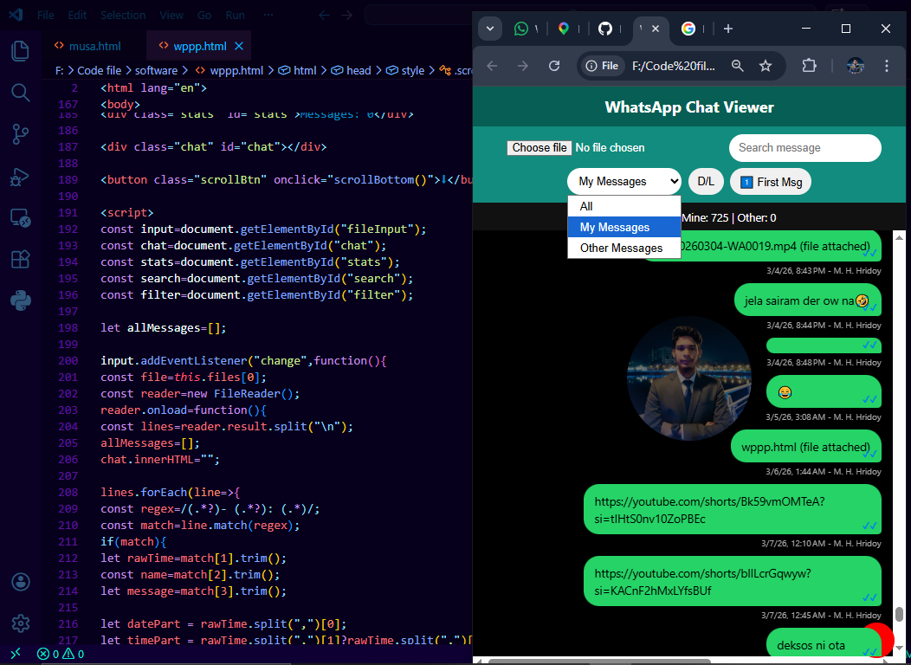
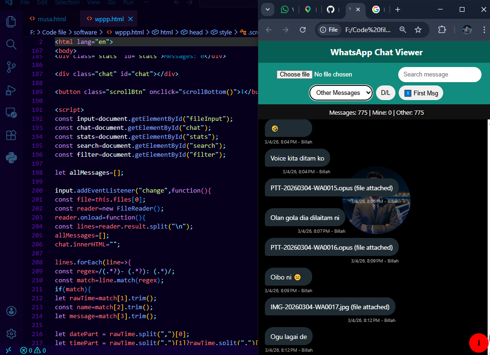

# WhatsApp Inbox Viewer

<div align="center">

[](https://github.com/mhhridoy7907)
[](LICENSE)
[](https://github.com/mhhridoy7907/whatsapp-inbox-viewer)


**A lightweight, privacy-focused WhatsApp chat viewer for exported `.txt` conversations.**

Transform plain WhatsApp chat exports into a clean, searchable, filterable, and WhatsApp-inspired chat interface — directly in your browser.

[**Live Demo**](https://chatviewer-2d185.web.app/) • [**Repository**](https://github.com/mhhridoy7907/whatsapp-inbox-viewer) • [**Report a Bug**](https://github.com/mhhridoy7907/whatsapp-inbox-viewer/issues)

</div>

---

## 🎯 Project Purpose

**WhatsApp Inbox Viewer** was created to solve a simple but practical problem: **WhatsApp chat data can become difficult to access, review, and analyze when conversations become very large or when the original chat is no longer available in WhatsApp.**

Users can export WhatsApp conversations as `.txt` files, but large exported conversations are difficult to read and navigate because they are stored as plain text.

This project transforms those exported chat files into a **clean, searchable, filterable, and interactive WhatsApp-inspired interface** directly in the browser.

### 💡 Why Was It Built?

The project was built to help users:

* 📂 Keep a readable copy of important WhatsApp conversations after exporting them.
* 🔎 Quickly search for specific words, names, or messages in large conversations.
* 🏷️ Filter messages between the user's messages and other participants' messages.
* 📊 View basic chat statistics such as total, sent, and received messages.
* 🕒 Navigate through long conversations more easily.
* 📝 Review old conversations without opening WhatsApp.
* 🔐 Analyze exported chat data privately without sending it to a backend server.

### 🧩 Problem It Solves

When a WhatsApp conversation contains thousands of messages, finding a specific message or reviewing the overall conversation can become difficult.

A user may also export a conversation for backup and later lose access to the original WhatsApp chat. The exported `.txt` file still contains the conversation, but reading and analyzing it as raw text is inconvenient.

**WhatsApp Inbox Viewer bridges this gap by converting the exported text into an interactive chat-viewing experience.**

### 🔍 What Can Be Done With It?

A user can export a WhatsApp conversation and then:

1. Upload the exported `.txt` file.
2. View the conversation in a WhatsApp-inspired interface.
3. Search for specific keywords or messages.
4. Filter messages by sender.
5. View basic chat statistics.
6. Navigate through long conversations more easily.
7. Review the conversation without uploading the chat content to a server.

### 🔐 Privacy by Design

The uploaded chat file is processed **directly in the browser**. The application does not require a backend server to process the conversation.

This allows users to review potentially sensitive conversations while keeping the chat data on their own device.

> **Important:** WhatsApp Inbox Viewer does **not** recover deleted messages from WhatsApp servers. It can only display and analyze chat data that the user already has, such as an exported `.txt` file.

---

## 📸 Screenshots

### Main Interface


*WhatsApp-inspired chat interface with message bubbles.*

### Dark Mode & Filters



*Theme switching and message filtering.*

### Search & Statistics



*Message search, highlighting, and chat statistics.*

---

## ✨ Features

### Core Features

* 📤 **Easy Chat Upload** — Upload or drag-and-drop exported WhatsApp `.txt` files.
* 💬 **WhatsApp-Inspired Chat UI** — View messages using familiar chat bubbles.
* 🟢 **User Differentiation** — Visually distinguish your messages from other participants.
* 🕒 **Message Metadata** — Display timestamps and sender names.
* ⚡ **Instant Rendering** — Process and display chats directly in the browser.
* 📱 **Responsive Design** — Works across desktop and mobile devices.

### Advanced Features

* 🌙 **Dark & Light Mode** — Switch between themes for comfortable viewing.
* 🔍 **Search & Highlight** — Search messages and highlight matching text.
* 🏷️ **Message Filtering** — Filter between all, user, and other messages.
* ✔✔ **WhatsApp-Style Read Indicators** — Display double-tick indicators for sent messages.
* 📊 **Chat Statistics** — View total, sent, and received message counts.
* 🖼️ **Media Detection** — Detect `<Media omitted>` messages.
* 🧭 **Quick Navigation** — Jump through the conversation easily.
* ⚡ **Smooth Scrolling** — Automatically navigate to the latest messages.
* 🔒 **Client-Side Processing** — Chat content does not need to be uploaded to a backend.

---

## 🚀 Quick Start

### Prerequisites

You only need:

* A modern web browser such as Chrome, Firefox, Safari, or Edge.
* An exported WhatsApp chat file in `.txt` format.

### Export a WhatsApp Chat

1. Open **WhatsApp** on your phone.
2. Open the conversation you want to export.
3. Open the **Menu** (`⋮`) → **More** → **Export Chat**.
4. Select **Without Media** for a smaller and faster export.
5. Save the exported `.txt` file.

### Use the Application

1. Open the [**WhatsApp Inbox Viewer**](https://chatviewer-2d185.web.app/).
2. Click **Upload Chat (.txt)** or drag and drop your file.
3. The conversation will be parsed and displayed automatically.
4. Use search, filters, navigation, themes, and statistics to explore the chat.

---

## 💻 Installation

### Clone the Repository

```bash
git clone https://github.com/mhhridoy7907/whatsapp-inbox-viewer.git
cd whatsapp-inbox-viewer/Code
```

### Run Locally

You can open `index.html` directly in your browser.

#### Windows

```bash
start index.html
```

#### macOS

```bash
open index.html
```

#### Linux

```bash
xdg-open index.html
```

### Recommended: Local Development Server

Using Python:

```bash
python -m http.server 8000
```

Or using Node.js:

```bash
npx http-server
```

Then open:

```text
http://localhost:8000
```

---

## 📁 Project Structure

```text
whatsapp-inbox-viewer/
│
├── Code/
│   ├── index.html          # Main application
│   ├── function.js         # Application logic
│   ├── style.css           # UI styling and responsive design
│   │
│   ├── wp.png              # Main preview
│   ├── wpp.png             # Additional preview
│   ├── up.png              # Feature preview
│   ├── up1.png             # Dark mode / filter preview
│   ├── up2.png             # Search / statistics preview
│   └── up3.png             # Additional feature preview
│
├── README.md               # Project documentation
├── LICENSE                 # MIT License
└── .gitignore              # Git configuration
```

---

## 🛠️ Technology Stack

| Technology             | Purpose                                                              |
| ---------------------- | -------------------------------------------------------------------- |
| **HTML5**              | Application structure                                                |
| **CSS3**               | Styling, animations, and responsive layout                           |
| **Vanilla JavaScript** | File parsing, DOM manipulation, search, filtering, and interactivity |

### Why These Technologies?

* ✅ No frameworks required
* ✅ No build system required
* ✅ Lightweight architecture
* ✅ Fast browser-based processing
* ✅ Easy to understand and modify
* ✅ Can work offline after the application files are available locally

---

## 📖 Usage Guide

### 💬 View a Chat

1. Upload a WhatsApp `.txt` export.
2. The application parses the messages automatically.
3. Messages appear in a WhatsApp-inspired chat interface.
4. Scroll through the conversation normally.

### 🔍 Search Messages

Use the search field to:

* Find specific words.
* Search names or phrases.
* Locate messages in large conversations.
* Highlight matching results.

### 🏷️ Filter Messages

Available filters:

| Filter    | Description                              |
| --------- | ---------------------------------------- |
| **All**   | Display all messages                     |
| **User**  | Display your sent messages               |
| **Other** | Display messages from other participants |

### 🌙 Theme

Use the theme button to switch between:

* Dark Mode
* Light Mode

Your selected preference can be remembered for future sessions.

### 📊 Statistics

The statistics section can display:

* Total messages
* Messages sent by you
* Messages received from others

---

## 🎯 Supported Chat Format

The application supports standard WhatsApp exported `.txt` conversations.

Example:

```text
[12/3/26, 10:30:45 AM] Your Name: Hey there!
[12/3/26, 10:31:12 AM] Their Name: Hi! How are you?
[12/3/26, 10:32:00 AM] Your Name: <Media omitted>
```

### Supported Content

* ✅ Standard WhatsApp `.txt` exports
* ✅ Private conversations
* ✅ Group conversations
* ✅ Multiple chat languages
* ✅ Media-omitted messages
* ✅ Large exported conversations

> Actual parsing compatibility may vary depending on the WhatsApp export format and device locale.

---

## 🔐 Privacy & Security

Privacy is one of the main design principles of this project.

* 🔒 **Client-Side Processing** — Chat files are processed in the browser.
* 🛡️ **No Chat Backend** — The application does not require a server to process uploaded chats.
* 🚫 **No Chat Upload Required** — Your conversation does not need to be sent to a remote server.
* 📂 **Local File Processing** — The selected `.txt` file is read by the browser.
* 👨‍💻 **Open Source** — The source code is publicly available for inspection.

> The website may be hosted online, but the exported chat content is intended to be processed locally in the browser.

---

## 🔮 Roadmap

Future improvements may include:

* 📅 Date separators between different dates
* 🖼️ Media preview and media file support
* 👤 Profile avatars and improved participant identification
* 📊 Advanced chat analytics
* 🎨 Custom themes and color schemes
* 📥 Export conversations as PDF or images
* 🔔 Additional message indicators
* 📱 Progressive Web App (PWA) support
* 🚀 Performance improvements for extremely large chat files

---

## 📝 Changelog

### Version 2.0 — March 24, 2026

**Major Update — Advanced Features Release**

#### Added

* ✅ WhatsApp-style double-tick indicators
* ✅ Quick navigation
* ✅ Search highlighting
* ✅ Message filtering
* ✅ Dark and Light mode
* ✅ Media-omitted message detection
* ✅ Chat statistics
* ✅ Smooth scrolling

#### Improved

* 🎨 Responsive interface
* ⚡ Rendering performance
* 📱 Mobile experience
* 🐛 Stability and bug fixes

---

### Version 1.0 — March 12, 2026

**Initial Release**

* Basic WhatsApp-inspired chat viewer
* `.txt` file upload
* WhatsApp chat parsing
* Message bubble interface
* User/other message differentiation
* Automatic scrolling
* Responsive design

---

## 🐛 Bug Reports & Feature Requests

Found a bug or have an idea for a new feature?

* 🐛 [**Report a Bug**](https://github.com/mhhridoy7907/whatsapp-inbox-viewer/issues)
* 💡 [**Request a Feature**](https://github.com/mhhridoy7907/whatsapp-inbox-viewer/issues)

When reporting an issue, please include:

* A clear description of the problem
* Steps to reproduce the issue
* Screenshots or examples if available
* Browser and operating system information

---

## 🤝 Contributing

Contributions, suggestions, and improvements are welcome.

If you would like to contribute:

1. Fork the repository.
2. Create a new branch.
3. Make your changes.
4. Test the application.
5. Commit your changes.
6. Open a Pull Request.

---

## 📄 License

This project is licensed under the **MIT License**.

See the [LICENSE](LICENSE) file for the complete license text.

### MIT License Allows

* ✅ Personal use
* ✅ Commercial use
* ✅ Modification
* ✅ Distribution
* ✅ Private use

The original copyright and license notice must be retained.

---

## 🙏 Acknowledgments

* **WhatsApp** — Inspiration for the familiar chat interface and user experience.
* **Open Source Community** — Inspiration, feedback, and development resources.
* **Users & Contributors** — Everyone who provides feedback and helps improve the project.

> This project is an independent open-source application and is not affiliated with or endorsed by WhatsApp or Meta.

---

## 👨‍💻 Author

**MH Hridoy**

**WhatsApp: +880 1962-388570**

* Live Demo: [WhatsApp Inbox Viewer](https://chatviewer-2d185.web.app/)

---

## ⭐ Show Your Support

If you find **WhatsApp Inbox Viewer** useful:

* ⭐ Star the repository
* 🐛 Report bugs
* 💡 Suggest new features
* 🤝 Contribute improvements
* 📢 Share the project with others

Every contribution and piece of feedback helps improve the project.

---


<div align="center">

### Made with ❤️ by **MH Hridoy**

**WhatsApp Inbox Viewer**

*Last Updated: March 24, 2026*

</div>
